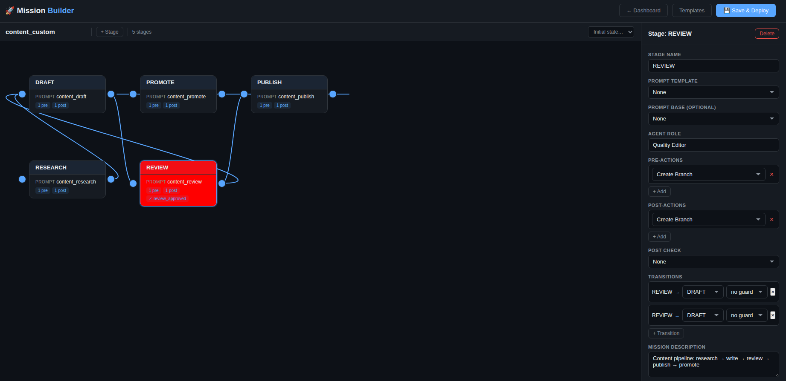

# Mission Control

[](LICENSE)
[](https://www.python.org/downloads/)
[](https://test.pypi.org/project/agno-mission-control/0.3.0/)

> **A self-orchestrating AI agent platform that runs autonomous missions — not just code, but any workflow you can define as a YAML state machine.** Ships with two ready-to-go missions: a **build** pipeline (branch → code → PR) and a **content** pipeline (research → draft → review → publish → promote). Need something else? Define a deploy mission, a QA mission, an infra monitoring mission — any multi-stage workflow where agents pick up work, execute steps, and hand off to the next stage. Agents are YAML config entries, not code. Transitions are guarded by deterministic checks, not LLM output. Vision runs 16 automated health checks every hour, alerts you via Telegram, and you can fix issues from your phone in real-time. The entire system runs on modest hardware (even a $12 cloud server) because all LLM inference is delegated to GitHub Copilot SDK — no local GPU, no expensive API bills. Only a `GITHUB_TOKEN` is required; everything else (Telegram, Tavily, DigitalOcean) is bring-your-own-keys. The Agno framework silently learns from every interaction, so your squad gets measurably better at your workflows over days and weeks without manual tuning.

> **Inspiration:** This project was inspired by [Bhanu Teja P's (@pbteja1998)](https://x.com/pbteja1998) original [Mission Control thread](https://x.com/pbteja1998/status/2017662163540971756) — a squad of autonomous AI agents led by Jarvis that create work, claim tasks, communicate, review each other, and collaborate as a real team. That vision is the foundation this project builds on, adapted for GitHub Copilot SDK and the Agno framework.

## Quick Start

```bash
pipx install agno-mission-control   # or: pip install agno-mission-control
mc setup                             # interactive wizard — configures everything
```

That's it. The wizard detects your system, authenticates GitHub, sets up the database, seeds agents, installs services, and starts them.

## What It Does

Mission Control is a **mission-driven agent orchestration platform**. You define missions (state machines), guards (transition checks), and agents (YAML config) — the platform handles scheduling, coordination, health monitoring, and learning.

- **Flexible missions** — ships with `build` (branch → code → PR), `content` (research → write → review → publish → promote), and `verify` (review → approve) — or define any workflow as a YAML state machine
- **Config-driven agents** — 18 default across two missions, add more by copying a YAML block. No code per agent.
- **Visual Mission Builder** — drag-and-drop workflow designer with live deploy
- **Deterministic guards** — transitions gated by factual checks (PR exists? branch created? files valid?), never by LLM output
- **GitHub Copilot SDK** (GPT-4.1) as LLM — runs on modest hardware, no local GPU needed
- **BYOK MCP tools** — GitHub ships built-in. Bring Your Own Keys for Telegram, Tavily, DigitalOcean, Twilio, or any MCP server. Add new tools by dropping an entry in `mcp_servers.yaml`.
- **Vision Healer** — 16 automated health checks hourly (CPU, disk, memory, pipeline, services), auto-fixes deterministically
- **Built-in dashboard** — Kanban board, agent status, activity feed, learning analytics
- **SQLite or PostgreSQL** — zero-config SQLite default, PostgreSQL for production

## Architecture

```
Human (Telegram / Dashboard)
         │
    ┌────▼────┐    ┌──────────┐
    │ mc-bot  │    │ mc-api   │  ← FastAPI :8000 (dashboard, kanban, API)
    └────┬────┘    └────┬─────┘
         │              │
    ┌────▼──────────────▼──────┐
    │   Copilot SDK (GPT-4.1)  │  ← Session per agent, MCP passthrough
    └────┬──────────────┬──────┘
         │              │
    ┌────▼────┐   ┌─────▼──────┐
    │ mc-mcp  │   │mc-scheduler│  ← APScheduler, staggered heartbeats
    │ SSE:8001│   └────────────┘
    └────┬────┘
         │
    ┌────▼────┐
    │ SQLite/ │  ← Zero-config default
    │ Postgres│
    └─────────┘
```

**4 systemd services** run independently:

| Service | Port | Description |
|---------|------|-------------|
| `mc-api` | 8000 | FastAPI — dashboard, kanban board, chat, task management |
| `mc-mcp` | 8001 | Mission Control MCP server (SSE) — task/agent/document tools |
| `mc-bot` | — | Telegram bot — primary human interface |
| `mc-scheduler` | — | APScheduler — triggers agent heartbeats on staggered intervals |

## Agent Squad

All agents are config-driven via `workflows.yaml`. Only Jarvis (lead orchestration) and Vision (deterministic ops) have custom Python — every other agent is a `GenericAgent` configured purely through YAML.

### Lead Agents

| Agent | Role | Interval | Description |
|-------|------|----------|-------------|
| **Jarvis** | Squad Lead | 15 min | Decomposes work, delegates, reviews PRs, gatekeeps REVIEW→DONE |
| **Vision** | System Healer | 1 hour | 16 automated health checks, auto-fixes, Telegram crisis mode escalation |

### Specialists (Build Squad)

| Agent | Role | Description |
|-------|------|-------------|
| **Friday** | Developer | Clean architecture, testing advocate |
| **Wong** | Documentation | Runbooks, technical docs, knowledge management |
| **Shuri** | Testing & QA | Edge cases, regression testing |
| **Fury** | Developer | Strategic, research-driven |
| **Pepper** | Developer | Pragmatic, ships fast |
| **Loki** | Developer | Creative problem solver |
| **Wanda** | Developer | Frontend specialist |

### Content Squad

| Agent | Role | Interval | Description |
|-------|------|----------|-------------|
| **Scout** | Trend Researcher | 6 hr | SEO keyword research, trending topics |
| **Ink** | SEO Writer | 15 min | Long-form content drafting |
| **Sage** | Quality Editor | 8 hr | Content review and approval |
| **Ezra** | Publisher | 3 hr | Publish to GitHub, format for web |
| **Herald** | Social Amplifier | 12 hr | Social media promotion |
| **Lurker** | Reddit Scout | 8 hr | Reddit outreach opportunities |
| **Morgan** | Content PM | 8 hr | Content strategy & coordination via Telegram |
| **Archie** | Analytics Reporter | 7 days | Performance analytics |

### Scaling Agents

Edit `~/.mission-control/workflows.yaml` to add or remove agents. Default ships with **18 agents** across two missions.

**Memory estimate:** Each agent spawns a Copilot SDK session (~565 MB). The platform overhead (API, scheduler, MCP, DB) adds ~500 MB.

| Agents | RAM (est.) | Guidance |
|--------|------------|----------|
| 18 | ~10.7 GB | Full squad — build + content missions |
| 9 | ~5.6 GB | Build squad only |
| 3 | ~2.2 GB | Core trio: Jarvis (lead), Friday (dev), Vision (ops) |
| 1 | ~1.1 GB | Jarvis only — single-agent mode |

> **Note:** If `workflows.yaml` is missing, the system falls back to a hardcoded 7-agent squad matching the defaults above. There is no silent agent inflation.

## Shipped Missions

Three missions ship out of the box. Define your own in `workflows.yaml` — any state machine with guards, pre/post actions, and prompt templates. See the [Custom Missions Guide](docs/CUSTOM_MISSIONS.md).

### `build` — Developer Workflow

```
ASSIGNED → IN_PROGRESS → REVIEW → DONE
               │            │
           (PR exists?) (Jarvis verifies)
               │            │
            No → ASSIGNED   No PR → ASSIGNED
```

Agents write code via MCP tools, create branches, and open PRs. Vision verifies PR existence before approving.

### `content` — Content Marketing Pipeline

```
RESEARCH → DRAFT → REVIEW → PUBLISH → PROMOTE → DONE
    │         │        │         │          │
 (Tavily)  (Write)  (Quality) (Publish)  (Social)
 web search  2000+   check &   commit    media
             words   approve   final     posts
```

A 5-stage content pipeline with automatic hand-offs between specialized agents:

| Stage | Agent Role | Pre-Actions | Post-Actions |
|-------|-----------|-------------|-------------|
| RESEARCH | Trend Researcher | `tavily_search` — web research | `github_commit` — research brief |
| DRAFT | SEO Writer | `github_read` — research brief | `github_commit` — draft article |
| REVIEW | Quality Editor | `github_read` — draft | `github_commit` — approved draft |
| PUBLISH | Publisher | `github_read` — draft | `github_commit` — published article |
| PROMOTE | Social Amplifier | `github_read` — published | `github_commit` — social posts |

### `verify` — Review Workflow

```
REVIEW → DONE        (if PR exists)
REVIEW → ASSIGNED    (if no PR — send back)
```

**Mission core is pure workflow management.** Transitions are gated by deterministic guards (PR exists? branch created? file committed?), never by LLM response parsing. The `content` mission demonstrates the full GenericMission engine — pre-actions gather context, prompts are rendered from templates, and post-actions persist deliverables to GitHub.

## Mission Builder

Define custom mission pipelines visually — drag stages, connect transitions, assign guards, and deploy with one click. No YAML editing required.



The builder supports:
- **Stage nodes** with prompt templates, pre/post actions, and guard conditions
- **Transitions** between stages with optional guard gates
- **Templates** — start from built-in build or content templates, or blank canvas
- **Save & Deploy** — writes to `workflows.yaml` and hot-reloads all agents instantly
- **Mission CRUD API** — `GET/POST/PUT/DELETE /api/missions` for programmatic management

## CLI Commands

```bash
mc setup                          # Interactive setup wizard
mc status                         # Agent status + service health + memory
mc start                          # Start all systemd services
mc stop                           # Stop all services
mc logs [-f] [service]            # View/tail logs
mc config                         # Show configuration paths
mc serve                          # Start API server (foreground)
mc heartbeat [agent]              # Trigger heartbeat manually
mc run <agent> "message"          # Chat with an agent
mc task -t "title" -a friday      # Create and assign a task
mc standup                        # Generate daily standup
mc init-db                        # Initialize database schema
mc seed-agents                    # Seed agent records
mc telegram                       # Start Telegram bot (foreground)
```

## Workflows & Missions

Workflows are defined in `workflows.yaml` — no code changes needed to add agents or missions.

### Adding an Agent

Copy any specialist block and change the fields:

```yaml
agents:
  new_agent:
    name: NewAgent
    role: Your Role Description
    level: specialist           # or: lead
    mission: build              # which mission this agent executes
    heartbeat_offset: 14        # minutes offset (stagger to avoid collisions)
    mcp_servers:
      - github                  # tools this agent can use
```

Special fields:
- `agent_class: healer` — use Vision's deterministic healer (only one instance)
- `heartbeat_interval: 3600` — override default 15-min heartbeat (seconds)
- `always_run.prompt` — execute this prompt every heartbeat (e.g. monitoring)

### Creating a Mission

Missions define state machines. Each transition can have a guard (factual check):

```yaml
missions:
  deploy:
    description: "Deploy workflow: build → staging → production"
    initial_state: PENDING
    default_config:
      target_env: staging
    transitions:
      - from: PENDING
        to: BUILDING
      - from: BUILDING
        to: STAGING
        guard: has_open_pr
      - from: STAGING
        to: PRODUCTION
        guard: files_changed_ok
```

### Available Guards

Guards are deterministic checks — no LLM involved:

| Guard | Description |
|-------|-------------|
| `has_open_pr` | Task has an open PR on GitHub |
| `no_open_pr` | Task has no open PR |
| `has_branch` | Feature branch exists |
| `has_error` | Last agent run produced an error |
| `files_changed_ok` | Changed files pass validation |
| `is_stale` | Task inactive for >90 min (configurable) |

Query available guards at runtime: `GET /workflow/guards`

### Hot-Reload

Workflow config can be updated without restarting:

```bash
# Via API
curl -X POST http://localhost:8000/workflow -d @workflows.yaml

# Via CLI (restart scheduler to pick up agent changes)
mc stop && mc start
```

## MCP Tool Servers

Agents get their capabilities from [MCP servers](https://modelcontextprotocol.io/) — pluggable tool providers defined in `mcp_servers.yaml`. Every agent also gets the built-in `mission-control` MCP server automatically (task/agent/document operations).

### Core Server (ships built-in)

| Server | Package | What It Does |
|--------|---------|-------------|
| `github` | `@modelcontextprotocol/server-github` | Repos, issues, PRs, branches, code search |

### BYOK (Bring Your Own Keys) Add-ons

These servers ship pre-configured — just provide API keys and they activate:

| Server | Package | What It Does | Required Key |
|--------|---------|-------------|-------------|
| `telegram` | `@zhigang1992/telegram-mcp` | Send/receive Telegram messages | `TELEGRAM_BOT_TOKEN` |
| `tavily` | `tavily-mcp` | Web search and research | `TAVILY_API_KEY` |
| `digitalocean` | `@digitalocean/mcp` | Apps, databases, droplets, deployments | `DO_API_TOKEN` |
| `twilio` | `twilio-mcp` | SMS and WhatsApp messaging | `TWILIO_ACCOUNT_SID` |

> **BYOK philosophy:** Only `GITHUB_TOKEN` is required. Every other integration is optional — bring your own API keys to unlock more capabilities. No keys = the server is simply skipped.

### Adding Your Own

Add an entry to `mcp_servers.yaml`, set env vars, and reference by name in the agent's config:

```yaml
# mcp_servers.yaml
servers:
  notion:
    command: "npx"
    args: ["-y", "@notionhq/mcp-server"]
    env_keys: [NOTION_API_KEY]
    env_map:
      NOTION_API_KEY: NOTION_API_KEY
    description: "Notion workspace management"
```

```yaml
# workflows.yaml — give the agent access
agents:
  docs_agent:
    name: DocsAgent
    role: Documentation Manager
    mission: build
    mcp_servers:
      - github
      - notion    # ← now this agent can read/write Notion
```

Any MCP-compliant server works. Verify registered servers: `GET /mcp/servers`. Hot-reload: `POST /mcp/reload`.

## Model Selection

Default: **GitHub Copilot SDK (GPT-4.1)** — no local GPU, no API bills (included with Copilot subscription). All agents share one Copilot client with per-agent sessions.

### Model Fallback Chain

```
1. GitHub Copilot SDK (GPT-4.1)    ← primary, recommended
2. Groq (llama-3.3-70b-versatile)  ← cloud fallback (if GROQ_API_KEY set)
3. Ollama (llama3.1:8b)            ← local fallback (if Ollama running)
```

Automatic failover — if the Copilot SDK is unreachable, agents fall back to Groq, then Ollama.

### Override via Environment

```bash
# .env
COPILOT_MODEL=gpt-4.1          # Primary model (any Copilot-supported model)
VISION_MODEL=gpt-4.1            # Vision agent can use a different model
DEFAULT_MODEL=llama3.1:8b       # Ollama model name
FALLBACK_MODEL=llama-3.3-70b-versatile  # Groq model name
OLLAMA_HOST=http://localhost:11434
GROQ_API_KEY=your_key_here
```

### Why Copilot SDK by Default?

| | Copilot SDK | Local Ollama | Groq |
|--|-------------|-------------|------|
| **Hardware** | ~1 GB RAM (platform only) | 8–48 GB+ VRAM | ~1 GB RAM |
| **Model quality** | GPT-4.1 (premium) | llama3.1:8b (decent) | llama-3.3-70b (good) |
| **Cost** | Copilot subscription | Free (needs GPU) | Free tier available |
| **Setup** | `gh copilot` + PAT | Install Ollama + pull | API key |

See [docs/MODEL_PROVIDERS.md](docs/MODEL_PROVIDERS.md) for detailed configuration.

## Configuration

All config lives in `~/.mission-control/` (or project root in dev mode):

| File | Purpose |
|------|---------|
| `.env` | GitHub PAT, database URL, Telegram token, MCP tokens |
| `workflows.yaml` | Agent definitions, missions, state transitions, guards |
| `mcp_servers.yaml` | MCP server definitions (command, args, env keys) |

### Custom Missions

Define entirely new mission types with **zero Python code** — just `workflows.yaml` + prompt `.md` files.
See the **[Custom Missions Guide](docs/CUSTOM_MISSIONS.md)** for the full schema reference,
built-in actions, prompt authoring, and a step-by-step walkthrough.

Example configs are provided in [`examples/missions/`](examples/missions/).

### Environment Variables

**Required:**

| Variable | Description |
|----------|-------------|
| `GITHUB_TOKEN` | GitHub PAT with `repo` + `copilot` scopes |

**Optional / BYOK:**

| Variable | Description |
|----------|-------------|
| `DATABASE_URL` | Default: SQLite. Set `postgresql://...` for PostgreSQL |
| `TELEGRAM_BOT_TOKEN` | Telegram notifications (recommended for visibility) |
| `TELEGRAM_CHAT_ID` | Your Telegram chat ID (required with Telegram) |
| `TAVILY_API_KEY` | Web search for content research agents |
| `DO_API_TOKEN` | DigitalOcean infra monitoring |
| `TWILIO_ACCOUNT_SID` | Twilio SMS/WhatsApp notifications |

## HTTP API & Dashboard

All endpoints are served by `mc-api` on port 8000. Full interactive docs at `/docs` (Swagger UI).

### Core API

| Method | Endpoint | Description |
|--------|----------|-------------|
| GET | `/` | Health check / root |
| GET | `/agents` | List all agents with status |
| POST | `/chat` | Chat with Jarvis (default lead) |
| POST | `/chat/{agent}` | Chat with a specific agent |
| POST | `/task` | Create a new task |
| GET | `/standup` | Generate daily standup summary |
| POST | `/heartbeat/{agent}` | Trigger an agent heartbeat manually |

### Workflow & Missions

| Method | Endpoint | Description |
|--------|----------|-------------|
| GET | `/workflow` | Current workflow config (full YAML as JSON) |
| POST | `/workflow` | Hot-reload workflow config from YAML body |
| GET | `/workflow/guards` | List available guard functions |
| GET | `/workflow/missions` | List mission definitions + state machines |
| GET/POST/PUT/DELETE | `/api/missions` | Mission CRUD (create, read, update, delete) |
| GET | `/dashboard/missions/builder` | Visual mission builder (HTML) |

### Dashboard & Kanban

| Method | Endpoint | Description |
|--------|----------|-------------|
| GET | `/dashboard` | Visual dashboard (HTML) with integrated kanban board |
| GET | `/dashboard/agents` | Agent data for dashboard |
| GET | `/dashboard/tasks` | Tasks with pagination + filters |
| GET | `/dashboard/activities` | Recent activity feed |

### Learning Analytics

| Method | Endpoint | Description |
|--------|----------|-------------|
| GET | `/dashboard/learning` | Learning dashboard (HTML) |
| GET | `/dashboard/learning/stats` | Aggregate learning stats |
| GET | `/dashboard/learning/timeline` | Event timeline (default: 24h) |
| GET | `/dashboard/learning/agents` | Per-agent learning metrics |
| GET | `/dashboard/learning/events` | Raw learning events (paginated) |
| GET | `/dashboard/learning/patterns` | Discovered patterns |
| GET | `/dashboard/learning/missions` | Per-mission stats |

### MCP Servers

| Method | Endpoint | Description |
|--------|----------|-------------|
| GET | `/mcp/servers` | List registered MCP servers |
| POST | `/mcp/reload` | Hot-reload MCP server config |

## Telegram Bot

The Telegram bot (`mc telegram`) is your primary remote interface to the entire system. It supports two operating modes with automatic escalation.

### Dual-Mode Chat

| Mode | Model | Behaviour |
|------|-------|-----------|
| **Jarvis** (default) | GPT-4.1 via Copilot SDK | Natural conversation — ask questions, create tasks, check status. Jarvis routes through the standard agent pipeline. |
| **Vision** (crisis) | Claude Opus 4.6 via Copilot CLI | Direct shell execution with `--allow-all`. Full system access — restart services, kill processes, run diagnostics, deploy fixes. |

Switch modes manually:

```
/jarvis    → Normal Jarvis mode (default)
/vision    → Escalate to Vision ops mode
```

### Auto-Escalation

If Jarvis fails to respond (timeout, error, or tool failure), the bot **automatically escalates to Vision mode** and retries:

```
You: "check the stuck PR on mission-control"
Jarvis: ❌ (tool timeout)
Bot: ⚠️ Auto-escalating to Vision mode...
Vision: ✅ "PR #42 has merge conflicts. Resolved and force-pushed."
```

After 2 consecutive successful Vision responses, the bot suggests handing back to Jarvis.

### Bot Commands

| Command | Description |
|---------|-------------|
| `/start` | Welcome message and command list |
| `/status` | System status — agents online, services running, last heartbeat |
| `/agents` | List the full agent squad with current status |
| `/standup` | Generate a daily standup summary from recent activity |
| `/vision` | Switch to Vision ops/crisis mode |
| `/jarvis` | Switch back to normal Jarvis mode |

Any message that isn't a command is treated as a chat message and routed to the active mode's agent.

### Progress Tracking

During long operations (code reviews, deployments, multi-file edits), the bot sends **live progress updates** to your chat:

- 🔍 Reviewing PR #42...
- 📖 Reading `src/core/factory.py`...
- ✏️ Writing `src/core/missions/generic.py`...
- 🌿 Creating branch `feat/content-pipeline`...
- 📊 Created 3 tasks

Updates start after 10s and repeat every 20s until the operation completes.

### Setup

1. Create a bot via [@BotFather](https://t.me/BotFather) on Telegram
2. Copy the bot token
3. Send any message to your bot, then get your chat ID from `https://api.telegram.org/bot<TOKEN>/getUpdates`
4. Set environment variables:

```bash
TELEGRAM_BOT_TOKEN=your-bot-token
TELEGRAM_CHAT_ID=your-chat-id
```

5. Start the bot:

```bash
mc telegram          # Foreground (for testing)
mc start             # Or as part of all services (systemd)
```

> **Without Telegram:** The system works fine — use the dashboard at `http://localhost:8000` and the CLI (`mc run jarvis "..."`) instead. Telegram is recommended for mobile/remote visibility.

## Vision Healer — Health Checks

Vision is the system's autonomous operations manager. Every hour it runs **16 deterministic checks** (no LLM involved in detection), auto-fixes what it can, and alerts you via Telegram for anything requiring human judgement.

When alerted via Telegram, you can respond in Vision mode to immediately act on the issue — making it a closed-loop system management tool from your phone.

| # | Check | Auto-Fix |
|---|-------|----------|
| 1 | Stale tasks (>1.5h no activity) | Reset to INBOX |
| 2 | Zombie processes (orphaned copilot/MCP) | Kill PIDs |
| 3 | Chatbot health | Alert human |
| 4 | Service health (4 systemd services) | Restart service |
| 5 | INBOX tasks with assignees | Transition → ASSIGNED |
| 6 | Log bloat (>50MB) | Truncate log files |
| 7 | Memory/swap pressure | Alert human |
| 8 | REVIEW tasks without PRs (respects verify_strategy) | Reset → ASSIGNED |
| 9 | Long-running tasks (>3h soft / >6h hard) | Alert or reset |
| 10 | Repo cleanliness (unauthorized changes) | Revert changes |
| 11 | CPU temperature (>80°C warning, >90°C critical) | Alert human |
| 12 | Disk usage (>80% warning, >90% critical) | Alert human |
| 13 | Load average (sustained high CPU) | Alert human |
| 14 | Top memory consumers (per-category audit) | Flag bloat |
| 15 | Orphaned python processes | Flag for cleanup |
| 16 | Pipeline health (tasks stuck >12h in any stage) | Alert human |

> **Closed-loop ops:** Vision detects → Telegram alerts → you respond in `/vision` mode → Vision fixes. All from your phone.

## Development

```bash
git clone https://github.com/Amaresh/agno-mission-control-copilot-sdk.git
cd agno-mission-control-copilot-sdk
python -m venv .venv && source .venv/bin/activate
pip install -e ".[dev]"
pytest tests/ -q    # 164 E2E tests (no mocks)
```

In dev mode, `paths.py` auto-detects the project root (via `pyproject.toml`) and uses it as `MC_HOME`. Set `MC_HOME=/custom/path` to override.

### Project Structure

```
agno-mission-control/
├── src/mission_control/           # Main package (PyPI distributable)
│   ├── cli.py                     # Typer CLI (mc command)
│   ├── config.py                  # Pydantic settings
│   ├── paths.py                   # Centralized path resolver
│   ├── setup_wizard.py            # mc setup interactive wizard
│   ├── api.py                     # FastAPI HTTP API
│   ├── telegram_bot.py            # Telegram bot
│   ├── scheduler_main.py          # Heartbeat scheduler
│   ├── defaults/                  # Shipped configs (workflows, mcp, systemd)
│   ├── static/                    # Dashboard HTML
│   ├── mission_control/core/      # State machine, database, factory
│   ├── mission_control/mcp/       # MCP server + registry
│   └── squad/                     # Agent working dirs (SOUL.md, daily/)
├── tests/                         # 164 E2E tests (no mocks)
├── infra/systemd/                 # Dev systemd service files
├── workflows.yaml                 # Active workflow config
├── mcp_servers.yaml               # Active MCP server definitions
└── pyproject.toml
```

## Acknowledgements

Inspired by [Bhanu Teja P's (@pbteja1998)](https://x.com/pbteja1998) original [Mission Control concept](https://x.com/pbteja1998/status/2017662163540971756). Built with [GitHub Copilot SDK](https://github.com/github/copilot-sdk), [Agno](https://github.com/agno-agi/agno), and [FastAPI](https://fastapi.tiangolo.com/).

## License

MIT
